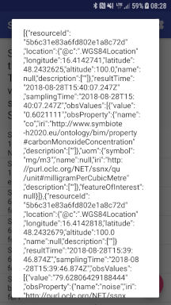
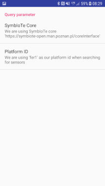

# SymbIoTe Android Client

An Android client examplifying some basic SymbIoTe L1 integration workflows like [searching for certain sensors](https://github.com/symbiote-h2020/SymbioteCloud/wiki/3.2-Search-for-resources) on specific platforms and retrieving the respective data.
To retrieve the data from a specific sensor from a specific platform, you will need some information about the sensor like what kind of data it provides (e.g. temperature, CO2 concentration,..) and optionally some information about the platform on which the sensor is hosted (e.g. the platform's name or id) to narrow the query to the core. For more information about the search please check out [SymbIote search](https://github.com/symbiote-h2020/SymbioteCloud/wiki/3.2-Search-for-resources).

After the query to the core lists you one or more matching sensors you can resolve the actual access URL and query the sensor on the platform directly. For more detail on how to access the sensor data please review [SymbIote security](https://github.com/symbiote-h2020/SymbIoTeSecurity).

It is mainly intented to be a starting point for your own SymbIoTe development doing more exciting stuff. I may help you by introducing some simple use cases accessing the basic SymbIoTe core infrastructure and your own platform dependent components.

The desired SymbIote core instance (open, prod, dev,...) and the target platform can be set via the apps preferences in the main menu.

## Components

These components are the cornerstones of the L1 workflwo described above and provide JavaDoc to guide you through the implementation:

* **[SymbIoTeClientActivity](./app/src/main/java/at/ac/ait/sac/SymbIoTeClientActivity.java)** - The main entry point for this demo

* **[SymbIoTeCoreSensorQueryTask](https://github.com/symbiote-h2020/SymbIoTeAndroidClient/blob/master/app/src/main/java/at/ac/ait/sac/SymbIoTeCoreSensorQueryTask.java)** - A background task to query the SymbIoTe core for registered sensors from various platforms

* **[SymbIoTeSensorReadingTask](https://github.com/symbiote-h2020/SymbIoTeAndroidClient/blob/master/app/src/main/java/at/ac/ait/sac/SymbIoTeSensorReadingTask.java)** - A background task to retrieve the actual sensor data from the target platform via SymbIoTe

For a complete description of all the components, please check the [JavaDocs](https://htmlpreview.github.com/?https://github.com/symbiote-h2020/SymbIoTeAndroidClient/blob/master/javadoc/index.html).

## SymbIoTe dependency

To use SymbIoTe in your own project just add the following dependency to your app level [build.gradle](https://github.com/symbiote-h2020/SymbIoTeAndroidClient/blob/master/app/build.gradle):

```json
    //SymbIoTe security client
    implementation 'com.github.symbiote-h2020:SymbIoTeSecurity4Android:27.2.0'
```

and allow the dependency download via jitpack:

```json
    repositories{
        google()
        //for SymbIoTe clients
        maven { url 'https://jitpack.io' }
    }
```

## Screenshots

### List sensors for platforms

The list of available sensors (registered at the core) after a successful query for a given platformId.


### Sensor response

After a successful response from the target platform the JSON will be displayed as a popup.



### Application preferences

To set the platformId to query the symbIoTe core for, simply adjust the respective values in the apps preference activity.

